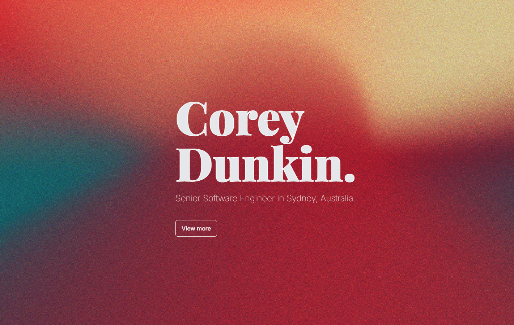

# Corey Dunkin - Senior Software Engineer Portfolio



## Overview

A modern, interactive portfolio website showcasing my experience, projects, and technical expertise as a Senior Software Engineer based in Sydney, Australia. This portfolio serves as both a professional introduction and a technical demonstration of modern web development approaches.

Visit the live site: [coreydunkin.com](https://coreydunkin.com)

## Features

- **Interactive Navigation**: Seamless page transitions with gesture-based navigation
- **Dynamic Theming**: Color extraction from project imagery to create cohesive visual experiences
- **Responsive Design**: Fully responsive across all device sizes with adaptive layouts
- **Print-Ready Resume**: Dedicated resume page with optimized print styling for PDF generation
- **Content Management**: Headless CMS integration for easy content updates
- **Performance Optimized**: Lighthouse score of 95+ across all metrics

## Technology Stack

### Frontend
- **Next.js 14**: Leveraging the latest React features with server components
- **TypeScript**: Type-safe code across the entire codebase
- **Framer Motion**: Advanced animations and transitions
- **Tailwind CSS**: Utility-first styling with custom configuration
- **SCSS Modules**: For component-specific styling
- **Three.js / React Three Fiber**: 3D background canvas elements
- **Zustand**: Lightweight state management

### Backend & Infrastructure
- **Contentful**: Headless CMS providing structured content
- **Next.js API Routes**: Serverless functions
- **Vercel**: Deployment and hosting platform

## Key Implementation Details

### Interactive Resume Page

The `/resume` route showcases a special implementation that combines several advanced techniques:

```typescript
// Responsive print styling for PDF generation
@media print {
  @page {
    size: A4;
    margin: 0.5cm;
  }
  body {
    -webkit-print-color-adjust: exact;
    print-color-adjust: exact;
  }
}
```

- **Custom Print Styling**: Specifically designed for clean PDF export
- **Dynamic Content**: Resume data pulled directly from Contentful
- **Rich Text Rendering**: Custom component for Contentful's rich text format
- **PDF Generation**: Client-side PDF creation from the rendered page

### Performance Optimizations

- Server components for reduced client-side JavaScript
- Image optimization with Next.js Image component
- Code splitting and lazy loading
- Hardware-accelerated animations
- SEO optimizations with structured metadata

### Content Management

Content is managed through Contentful, allowing for easy updates to:
- Portfolio projects
- Resume content
- Skills and experience
- Contact information

## Development

### Prerequisites
- Node.js (v18+)
- npm/yarn
- Contentful account with appropriate content model

### Local Setup

```bash
# Clone the repository
git clone https://github.com/coreydunkin/coreydunkin2024.git

# Navigate to the frontend directory
cd coreydunkin2024/frontend

# Install dependencies
npm install

# Create environment variables file (.env.local)
# Add Contentful credentials

# Start development server
npm run dev
```

## Deployment

The site is deployed on Vercel with continuous deployment from the main branch.

## License

© 2025 Corey Dunkin. All Rights Reserved.

---

Built with passion and modern web technologies by Corey Dunkin.
